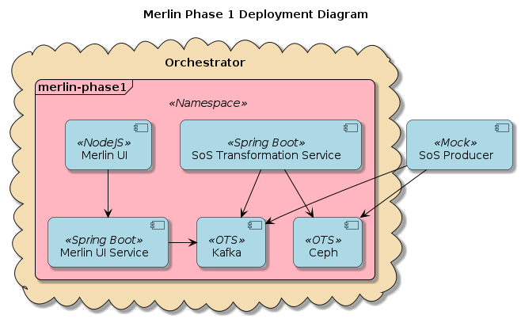
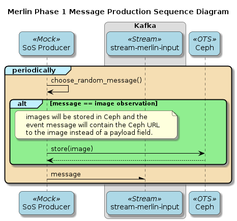
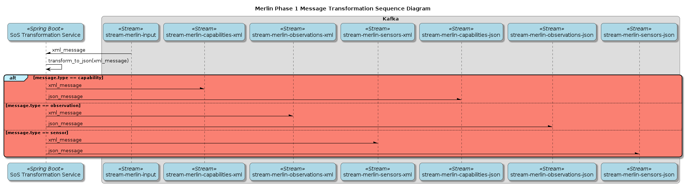
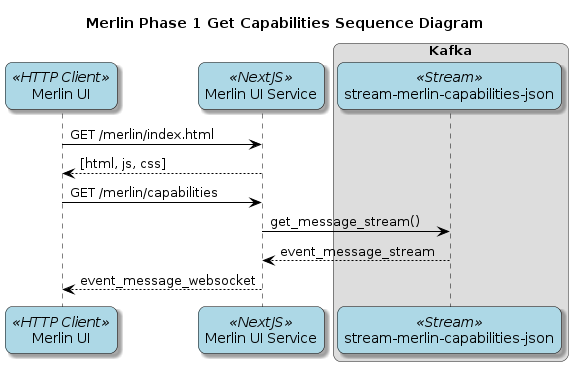

# Deployment Structure

The deployment structure for phase 1 of Merlin is shown below. An orchestration
solution has not been identified yet.

# Orchestration Options

The typical `Merlin` deployment scenarios are:

1.  Cloud-based for demos, exercises, etc
2.  Attending an event such as UV, BQ, etc - they often specify what hardware
    they need to run (3 VMs with X amount of storage, processing, and memory)
3.  Incorporated into a tactical environment - rack-mounted VM-system on a
    hummer, etc - similar to the event setup

## Kubernetes (Rancher Federal)

`Kubernetes` is a full-featured microservice platform including automated roll-out
and rollback, storage orchestration, load balancing, self-healing and horizontal
scaling across servers. AFDCGS has adopted `Rancher Federal` as their standard
`Kubernetes` solution.

The challenge with `Kubernetes` lies in getting it installed in the `MASBUS` target
environments.

## Docker

`Docker` represents one of the first attempts at containerization and remains the
de-facto container specification. However, it was designed to run within the
context of a single machine and doesn&rsquo;t address many of the questions that a
more robust solution such as `Kubernetes` does. Docker leaves the work of
application deployment, load balancing, scaling, etc. to the developer.

## Docker Compose

`Docker Compose` is an extension of basic `Docker` which moves the start/stop
commands into text files. `Docker Compose` provides command simplicity and
consistency. It doesn&rsquo;t provide significant features beyond that.

## Docker swarm

`Docker Swarm` is the `Docker` team&rsquo;s solution to workload distribution across
physical servers. It provides some of the features of `Kubernetes` but has largely
been preempted by it.

# Broker initialization

The code below creates `Kafka` topics on startup of the `SoSTransformationService`.
This code will be executed each time the service is started. If the topic
already exists with the same `partitionCount`, then the code will succeed. If the
`partitionCount` has increased, then `Kafka` will increase the number of partitions
for each topic but this will affect message ordering. The `partitionCount` should
never be decreased.

`replicaCount` cannot exceed the number of broker instances in the cluster which
will result in `org.apache.kafka.common.errors.InvalidReplicationFactorException`.

    @Configuration
    class KafkaStreamConfiguration {
        @Value
        private int partitionCount;
    
        @Value
        private int replicaCount;
    
        @Bean
        public NewTopic input() {
            return TopicBuilder.name("stream-merlin-input")
                .partitions(partitionCount)
                .replicaCount(replicaCount)
                .build();
        }
    
        @Bean
        public NewTopic capabilitiesXml() {
            return TopicBuilder.name("stream-merlin-capabilities-json")
                .partitions(partitionCount)
                .replicaCount(replicaCount)
                .build();
        }
    
        @Bean
        public NewTopic capabilitiesJson() {
            return TopicBuilder.name("stream-merlin-input")
                .partitions(partitionCount)
                .replicaCount(replicaCount)
                .build();
        }
    
        @Bean
        public NewTopic observationsXml() {
            return TopicBuilder.name( "stream-merlin-observations-xml")
                .partitions(partitionCount)
                .replicaCount(replicaCount)
                .build();
        }
    
        @Bean
        public NewTopic observationsJson() {
            return TopicBuilder.name("stream-merlin-observations-json")
                .partitions(partitionCount)
                .replicaCount(replicaCount)
                .build();
        }
    
        @Bean
        public NewTopic sensorsXml() {
            return TopicBuilder.name( "stream-merlin-sensors-xml")
                .partitions(partitionCount)
                .replicaCount(replicaCount)
                .build();
        }
    
        @Bean
        public NewTopic sensorsJson() {
            return TopicBuilder.name("stream-merlin-sensors-json")
                .partitions(partitionCount)
                .replicaCount(replicaCount)
                .build();
        }
    }

# Message Production Sequence Diagrams

# Message Transformation Sequence Diagram

# Get Capabilities Sequence Diagram

