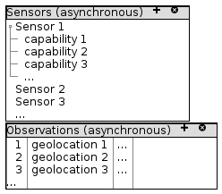

# Deployment

## Structure

The deployment structure for phase 1 of `Merlin` is shown below. The orchestrator
will be some flavor of Kubernetes. For local development, `k3s` is quick and easy
to setup.

## Orchestration

The typical `Merlin` deployment scenarios are:

1.  Cloud-based for demos, exercises, etc
2.  Attending an event such as UV, BQ, etc - they often specify what hardware
    they need to run (3 VMs with X amount of storage, processing, and memory)
3.  Incorporated into a tactical environment - rack-mounted VM-system on a
    hummer, etc - similar to the event setup

## Kubernetes

`Kubernetes` is a full-featured microservice platform including automated roll-out
and rollback, storage orchestration, load balancing, self-healing and horizontal
scaling across servers. AFDCGS has adopted `Rancher Federal` as their standard
`Kubernetes` solution.

The challenge with `Kubernetes` lies in getting it installed in the `MASBUS` target
environments. Due to the varied nature of `MASBUS` deployment scenarios, Merlin
should remain `Kubernetes` provider neutral. It should be deployable on AWS,
Rancher or any other CNCF-compatible `Kubernetes` flavor.

## Docker

`Docker` represents one of the first attempts at containerization and remains the
de-facto container specification. However, it was designed to run within the
context of a single machine and doesn&rsquo;t address many of the questions that a
more robust solution such as `Kubernetes` does. Docker leaves the work of
application deployment, load balancing, scaling, etc. to the developer.

## Docker Compose

`Docker Compose` is an extension of basic `Docker` which moves the start/stop
commands into text files. `Docker Compose` provides command simplicity and
consistency. It doesn&rsquo;t provide significant features beyond that.

## Docker swarm

`Docker Swarm` is the `Docker` team&rsquo;s solution to workload distribution across
physical servers. It provides some of the features of `Kubernetes` but has largely
been preempted by it.

# SoS Microservice

## Broker initialization

The code below creates `Kafka` topics on startup of the `SoSTransformationService`.
This code will be executed each time the service is started. If the topic
already exists with the same `partitionCount`, then the code will succeed. If the
`partitionCount` has increased, then `Kafka` will increase the number of partitions
for each topic but this will affect message ordering. The `partitionCount` should
never be decreased.

`replicaCount` cannot exceed the number of broker instances in the cluster which
will result in `org.apache.kafka.common.errors.InvalidReplicationFactorException`.

`bootstrapServer` is the `DNS` name within the `Kubernetes` cluster. These values are
injected at runtime from a `Kubernetes` `ConfigMap`.

    @EnableKafka
    @Configuration
    class KafkaStreamConfiguration {
        @Value("${mil.afdcgs.merlin.sos.kafka.partition-count:1}")
        private Integer partitionCount;
    
        @Value("${mil.afdcgs.merlin.sos.kafka.replica-count:1}")
        private Integer replicaCount;
    
        @Value("${mil.afdcgs.merlin.sos.kafka.bootstrap-server}")
        private String bootstrapServer;
    
        @Bean
        public KafkaAdmin kafkaAdmin() {
            Map<String, Object> configs = new HashMap<>();
            configs.put(AdminClientConfig.BOOTSTRAP_SERVERS_CONFIG, bootstrapServer);
            return new KafkaAdmin(configs);
        }
    
        @Bean
        public NewTopic input() {
            return TopicBuilder.name("stream-merlin-input")
                    .partitions(partitionCount)
                    .replicas(replicaCount)
                    .build();
        }
    
        @Bean
        public NewTopic observationsXml() {
            return TopicBuilder.name( "stream-merlin-observations-xml")
                    .partitions(partitionCount)
                    .replicas(replicaCount)
                    .build();
        }
    
        @Bean
        public NewTopic observationsJson() {
            return TopicBuilder.name("stream-merlin-observations-json")
                    .partitions(partitionCount)
                    .replicas(replicaCount)
                    .build();
        }
    
        @Bean
        public NewTopic sensorsXml() {
            return TopicBuilder.name( "stream-merlin-sensors-xml")
                    .partitions(partitionCount)
                    .replicas(replicaCount)
                    .build();
        }
    
        @Bean
        public NewTopic sensorsJson() {
            return TopicBuilder.name("stream-merlin-sensors-json")
                    .partitions(partitionCount)
                    .replicas(replicaCount)
                    .build();
        }
    
        @Bean
        public ConsumerFactory<Integer, String> consumerFactory(){
            Map<String,Object> props = new HashMap<String,Object>();
            props.put(ConsumerConfig.BOOTSTRAP_SERVERS_CONFIG, bootstrapServer);
            props.put(ConsumerConfig.KEY_DESERIALIZER_CLASS_CONFIG, IntegerDeserializer.class);
            props.put(ConsumerConfig.VALUE_DESERIALIZER_CLASS_CONFIG, StringDeserializer.class);
            props.put(ConsumerConfig.GROUP_ID_CONFIG, "merlin-phase1");
            props.put(ConsumerConfig.AUTO_OFFSET_RESET_CONFIG, "latest");
            return new DefaultKafkaConsumerFactory<>(props);
        }
    
        @Bean
        public ProducerFactory<Integer, String> producerFactory() {
            Map<String, Object> props = new HashMap<>();
            props.put(ProducerConfig.BOOTSTRAP_SERVERS_CONFIG, bootstrapServer);
            props.put(ProducerConfig.KEY_SERIALIZER_CLASS_CONFIG, IntegerSerializer.class);
            props.put(ProducerConfig.VALUE_SERIALIZER_CLASS_CONFIG, StringSerializer.class);
            return new DefaultKafkaProducerFactory<>(props);
        }
    
        @Bean
        public KafkaTemplate<Integer, String> kafkaTemplate(ProducerFactory producerFactory) {
            return new KafkaTemplate<Integer, String>(producerFactory);
        }
    
        @Bean
        public KafkaListenerContainerFactory<ConcurrentMessageListenerContainer<Integer,String>> kafkaListenerContainerFactory() {
            ConcurrentKafkaListenerContainerFactory<Integer, String> factory =
                    new ConcurrentKafkaListenerContainerFactory();
            factory.setConsumerFactory(consumerFactory());
            return factory;
        }
    }

## Message Transformation Sequence Diagram

# Mock Message Producer

## Message Production Sequence Diagram

# UI

## Wireframe

## Sequence Diagram

# Scope

The limited time available for `merlin phase 1` necessitates limiting the scope of
the project. The goal of this design is to produce a working prototype that can
also serve as the basis of a more complete project while bringing the team up to
speed on the selected technologies. In order to make that achievable within the
allotted time, some functionality is being omitted. These may be addressed if
time permits.

1.  The UI will display observations in text only. Geo-location data necessary to
    display the observations on a Map will be available and a map can be
    integrated into the UI at a later time.
2.  The current `MASBUS` application provides a `SOAP` endpoint that allows users to
    publish `SoS` messages. `Merlin Phase 1` will provide a mock message producer
    only, leaving the development of `SOAP` and `REST` interfaces to a future phase.
3.  `SSL`, `Authentication` and `Authorization` will be addressed in a future phase as
    well. `Kubernetes`-based solutions such as `CertManager` and/or `KeyCloak` should
    be identified and integrated.

