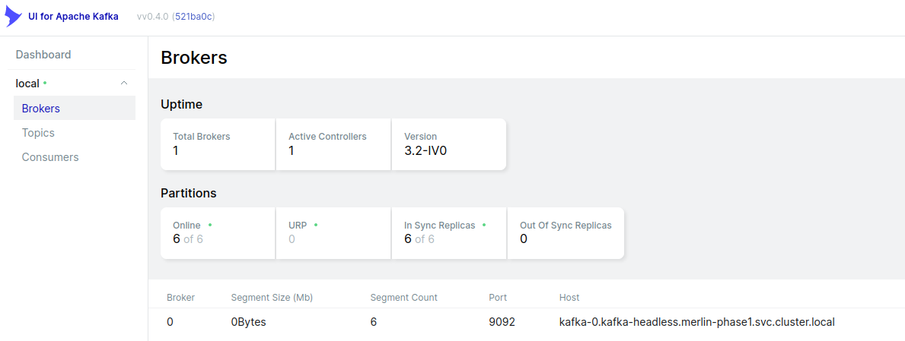
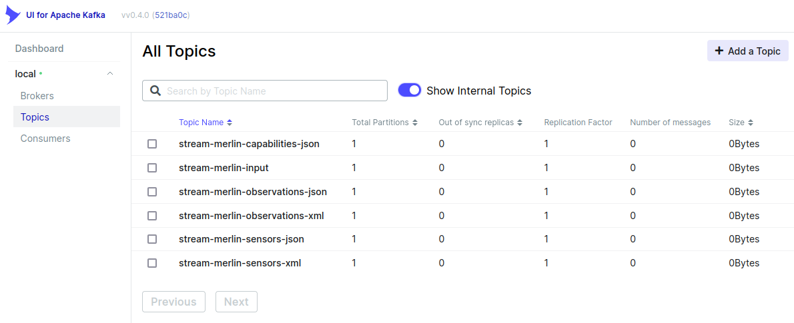
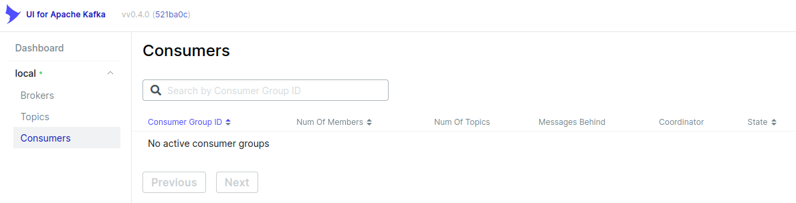

# Purpose

The `KafkaUI` app makes it very easy to monitor the performance of the `Kafka`
broker(s), connected clients, available topics, etc.

# Screenshots

# Installing the App

## Add Helm repository

    helm repo add kafka-ui https://provectus.github.io/kafka-ui

## Apply Helm Chart

    helm install kafka-ui kafka-ui/kafka-ui --set envs.config.KAFKA_CLUSTERS_0_NAME=local \
        --set envs.config.KAFKA_CLUSTERS_0_BOOTSTRAPSERVERS=kafka-0.kafka-headless.merlin-phase1.svc.cluster.local:9092

# Start the Kafka UI

Forward port 80 in the `KafkaUI` container to port 8080 on the host

    kubectl --namespace default port-forward kafka-ui-5d46b99bf-fvqpr 8081:8080

-   Access the unsecured `Kafka` UI at <http://localhost:8081>

