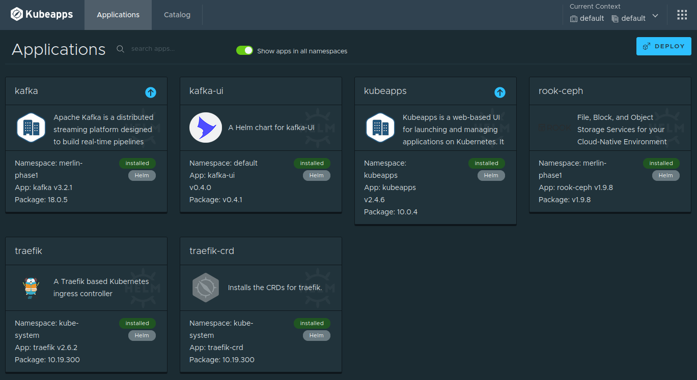
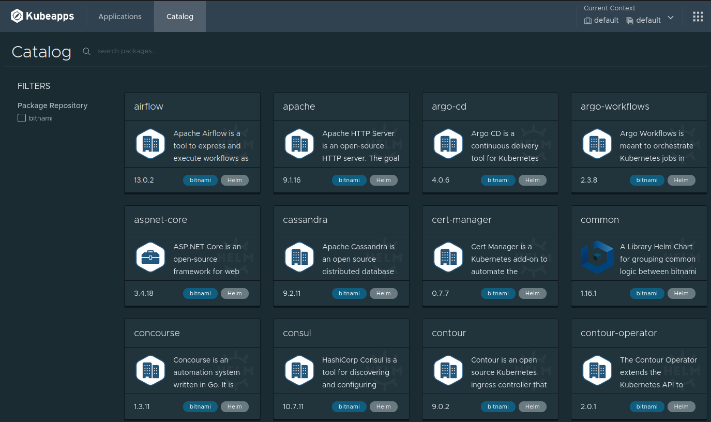

# Purpose

The `Kubeapps` dashboard simplifies the administration of the `Kubernetes` cluster
through the use of `Helm` charts.

# Screenshots

# Install the App

## Add Bitnami Helm repository

    helm repo add bitnami https://charts.bitnami.com/bitnami

## Apply Helm Chart

    helm install -n kubeapps --create-namespace kubeapps bitnami/kubeapps

# Create a Development Credential

## Create Service Account

This step creates a `Kubernetes` `ServiceAccount` for the `Kubeapps` dashboard

    kubectl create --namespace default serviceaccount kubeapps-operator

## Create Role Binding

Grants the `cluster-admin` role to the `ServiceAccount` created in the previous step.

    kubectl create clusterrolebinding kubeapps-operator --clusterrole=cluster-admin --serviceaccount=default:kubeapps-operator

## Create a Kubeapps Secret

Creates a login token for the `Kubeapps` dashboard

    cat <<EOF | kubectl apply -f -
    apiVersion: v1
    kind: Secret
    metadata:
      name: kubeapps-operator-token
      namespace: default
      annotations:
        kubernetes.io/service-account.name: kubeapps-operator
    type: kubernetes.io/service-account-token
    EOF

## Retrieve the Login Token

Extracts the login token created in the previous step. This token will be used
to login to the `Kubeapps` dashboard.

    kubectl get --namespace default secret kubeapps-operator-token -o go-template='{{.data.token | base64decode}}'

# Start the Kubeapps Dashboard

Forward port 80 in the `Kubeapps` container to port 8080 on the host

    kubectl port-forward -n kubeapps svc/kubeapps 8080:80

-   Login to the `Kubeapps` dashboard at <http://localhost:8080> using the token
    retrieved in the previous step.

