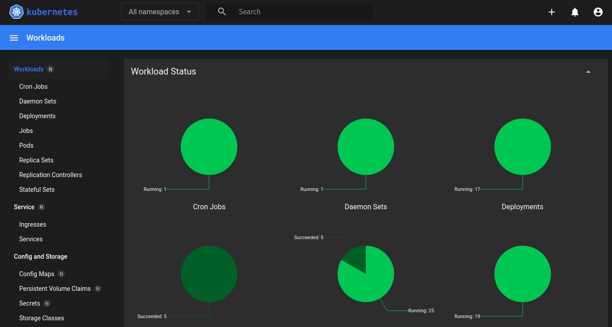

# Prerequisite

The `Kubernetes` server and client versions should match and be `> v1.24.0`. The
version installed can be determined with:

    kubectl version -o yaml

# Installation

## Install the Kubernetes Dashboard artifacts

    kubectl apply -f https://raw.githubusercontent.com/kubernetes/dashboard/v2.6.0/aio/deploy/recommended.yaml

## Define a Dashboard `ServiceAccount`

Place the block below in a file called `kubernetes-dashboard.yaml`

    apiVersion: v1
    kind: ServiceAccount
    metadata:
      name: admin-user
      namespace: kubernetes-dashboard
    ---
    apiVersion: rbac.authorization.k8s.io/v1
    kind: ClusterRoleBinding
    metadata:
      name: admin-user
    roleRef:
      apiGroup: rbac.authorization.k8s.io
      kind: ClusterRole
      name: cluster-admin
    subjects:
    - kind: ServiceAccount
      name: admin-user
      namespace: kubernetes-dashboard

## Apply the Artifacts

    kubectl apply -f kubernetes-dashboard.yaml

## Extract the Login token

You&rsquo;ll need a login token to access the dashboard. The command below will create
one:

    kubectl -n kubernetes-dashboard create token admin-user

## Start the Proxy

The command below will start a proxy that will forward requests from `localhost`
to the dashboard. This dashboard will only be available from the machine where
the proxy was started.

    kubectl proxy

# Accessing the Dashboard

To access the dashboard, navigate to:
`http://localhost:8001/api/v1/namespaces/kubernetes-dashboard/services/https:kubernetes-dashboard:/proxy/`.
You should be presented with the login screen.

Copy and past the token and click the `Sign in` button. This should present you
with the main dashboard screen.

