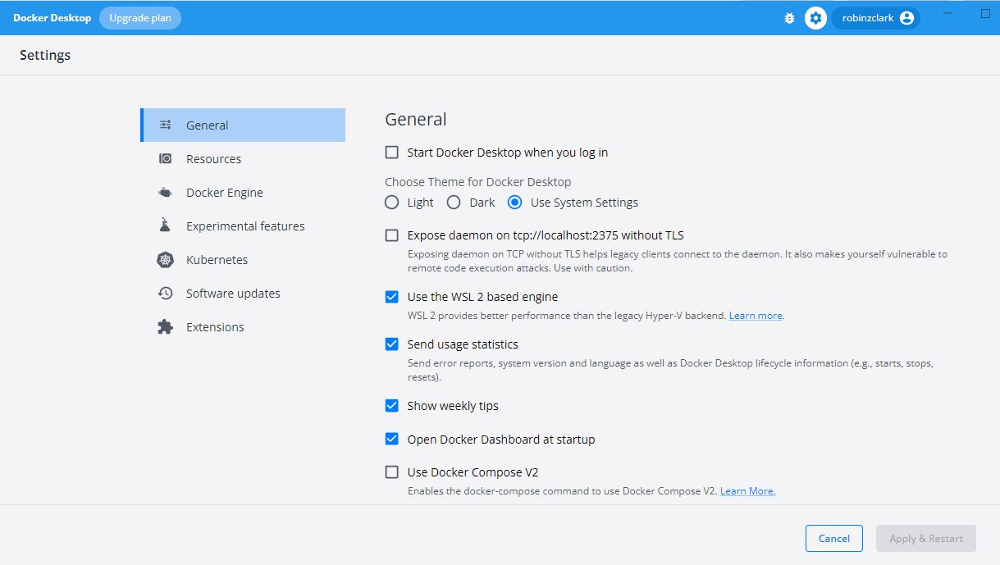
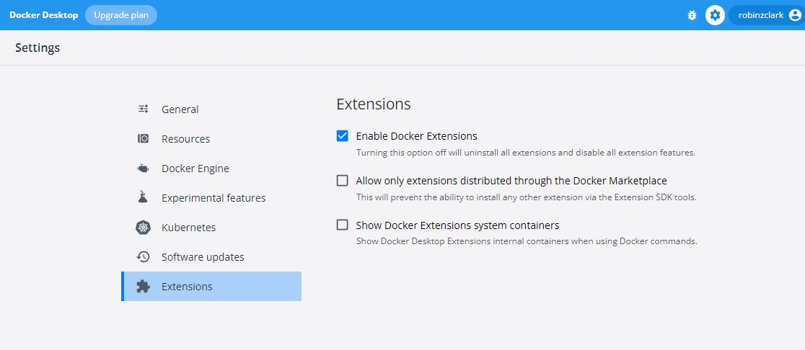
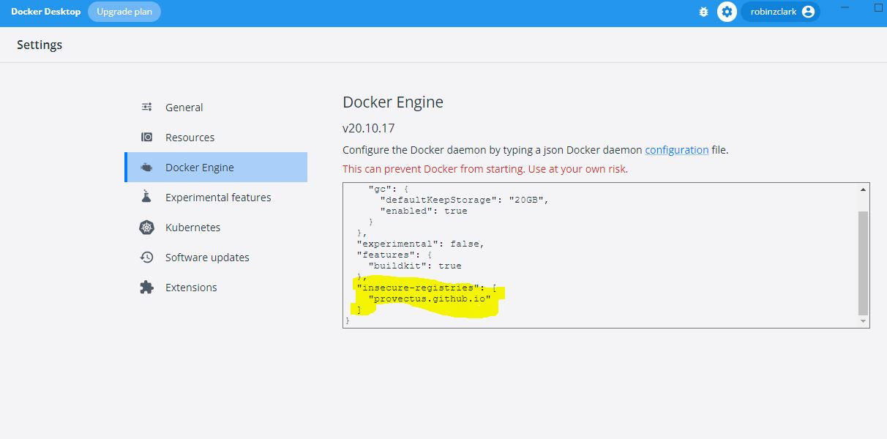
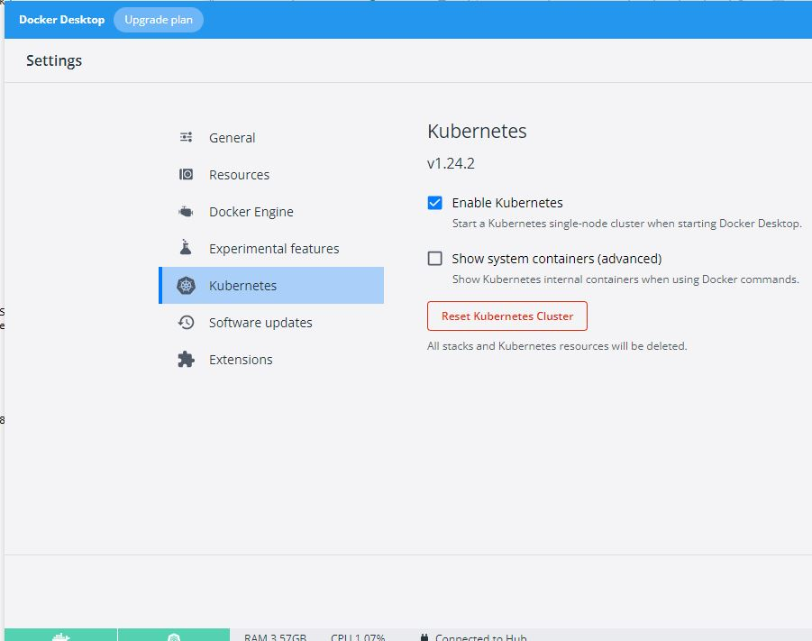
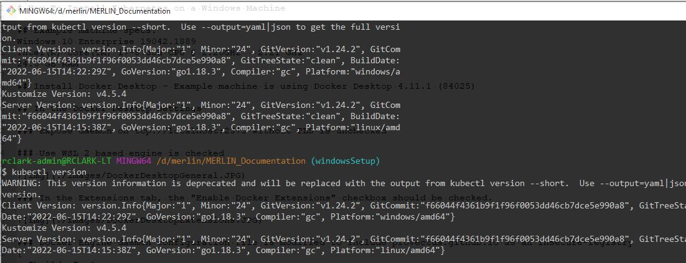

# How To Install Kubernetes on Docker Desktop for Windows

## Example machine specs:

-   Windows 10 Enterprise 19042.1889
-   Intel(R) Core(TM) i7-8750H CPU @ 2.20GHz   2.21 GHz
-   24.0 GB RAM

## Install Docker Desktop

-   Example machine is using Docker Desktop 4.11.1 (84025)

## In the Docker Desktop Settings

-   Expose daemon on tcp://localhost:2375 without TLS is unchecked

-   Use WSL 2 based engine is checked

### In the Extensions tab

-   the &ldquo;Enable Docker Extensions&rdquo; checkbox should be checked.

### Modify the Docker Engine daemon configuration file:

-   include `provectus.github.io` as an insecure-registry

    {
      "builder": {
        "gc": {
          "defaultKeepStorage": "20GB",
          "enabled": true
        }
      },
      "experimental": false,
      "features": {
        "buildkit": true
      },
      "insecure-registries": [
        "provectus.github.io"
      ]
    }

### In the Settings Kubernetes section

-   before checking the &ldquo;Enable Kubernetes&rdquo; checkbox, it is critical to uninstall
    any previous attempts to install any other k8s installation including k3s,
    minikube, kind etc.

-   This may include deleting directories from both your `C:\Users\username` and
    `C:\Users\username-admin`.  If any previous k8s installations remain, the
    enabling of Kubernetes in Docker Desktop will not be successful!

-   After you check the &ldquo;Enable Kubernetes&rdquo; checkbox, be patient.  It might take
    quite some time to download the needed components and no meaningful feedback
    appears on the screen.

-   After Kubernetes has been enabled successfully, in the lower left hand corner
    of the Docker Desktop GUI you will see a green bar for both Docker and
    Kubernetes indicating that they are running successfully.

-   You should be able to issue the command &ldquo;kubectl version&rdquo; in git bash,
    cmd.exe, or windows terminal command prompt.

-   Note: Docker Desktop is run as admin. Git bash is run as admin. `cmd.exe` is run as admin.
